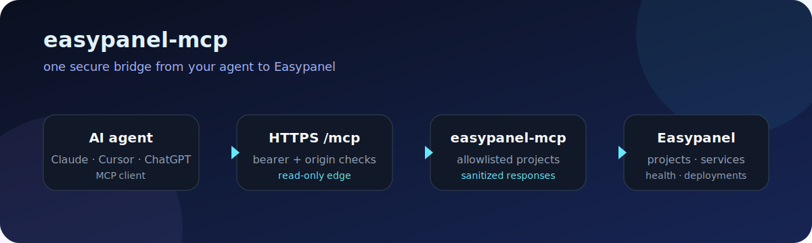

<div align="center">

# easypanel-mcp

**Connect your AI agent to Easypanel. Read-only by default.**

<p>
  <a href="https://github.com/Yuhtin/easypanel-mcp/actions/workflows/ci.yml"></a>
  <a href="https://github.com/Yuhtin/easypanel-mcp/pkgs/container/easypanel-mcp"></a>
  <a href="LICENSE"></a>
</p>



</div>

Give Claude, ChatGPT, Cursor, or any MCP client a safe view of your Easypanel
projects, services, health, deployments, and sanitized logs.

## Start here (recommended)

Run it as one Easypanel App Service. There is no Node.js installation on your
computer and no repository build step.

### 1. Create the service

In Easypanel: **New Service → App Service → Docker Image**.

Paste this image:

```text
ghcr.io/yuhtin/easypanel-mcp:latest
```

`latest` is updated automatically whenever a new release is published.

Set:

- internal port: `3000`
- one replica
- HTTPS domain, for example `https://mcp.example.com`
- persistent volume: `/app/.state`
- automatic restart enabled
- no public host port

### 2. Add the environment variables

Create a separate MCP access token with:

```bash
openssl rand -hex 32
```

Add these variables in Easypanel. Replace the values in angle brackets:

```dotenv
EASYPANEL_MCP_TRANSPORT=http
EASYPANEL_MCP_HTTP_BIND_HOST=0.0.0.0
EASYPANEL_MCP_HTTP_PUBLIC_ORIGIN=https://mcp.example.com
EASYPANEL_MCP_ACCESS_TOKEN=<token-generated-above>

EASYPANEL_URL=https://panel.example.com
EASYPANEL_TOKEN=<easypanel-api-token>
EASYPANEL_ACCESS_MODE=readonly
EASYPANEL_ALLOWED_PROJECTS=my-project
EASYPANEL_EXPECTED_VERSION=2.31.0
```

`EASYPANEL_MCP_ACCESS_TOKEN` and `EASYPANEL_TOKEN` are different secrets.
Keep both in Easypanel's secret fields. The project allowlist must name the
projects this MCP may see; `*` is not accepted.

### 3. Connect your agent

Copy this into the MCP configuration of your client:

```json
{
  "mcpServers": {
    "easypanel": {
      "url": "https://mcp.example.com/mcp",
      "headers": {
        "Authorization": "Bearer <EASYPANEL_MCP_ACCESS_TOKEN>"
      }
    }
  }
}
```

### 4. Check it

```bash
curl -i https://mcp.example.com/healthz
```

`204` means the service is alive. Your agent should see exactly seven remote
tools: projects, services, service inspection, health, deployments, deployment
status, and sanitized logs.

## What it can do

Remote mode is deliberately read-only. It cannot deploy, apply, rotate secrets,
destroy services, execute shell commands, access the Docker socket, or act as a
general host administration API.

Local stdio mode also supports planning and guarded operations when you
explicitly need them on a trusted machine. The approval flow, audit log, and
full environment reference are documented in [`.env.example`](.env.example).

## Local development

```bash
git clone https://github.com/Yuhtin/easypanel-mcp.git && cd easypanel-mcp && npm ci && npm run build
```

Set `EASYPANEL_MCP_TRANSPORT=stdio` and the required Easypanel variables, then
run:

```bash
npm start
```

Run the checks before opening a pull request:

```bash
npm run check
```

## Security defaults

- Remote HTTP is always `readonly`.
- HTTPS, exact host validation, and a separate bearer token are required.
- Project access is an explicit allowlist.
- Responses redact environment values and credentials.
- Upstream calls, request sizes, sessions, and concurrency are bounded.

This is a preview release. Test it against a disposable Easypanel instance
before using it for production operations. See the [security model](docs/security-model.md)
and [security policy](SECURITY.md) for details.

## Links

- [Easypanel deployment details](deploy/easypanel/README.md)
- [Tool contract](docs/tool-contract.md)
- [Validation notes](docs/validation.md)
- [Contributing](CONTRIBUTING.md)
- [Release `v0.1.0`](https://github.com/Yuhtin/easypanel-mcp/releases/tag/v0.1.0)

## License

Apache-2.0. See [LICENSE](LICENSE).
